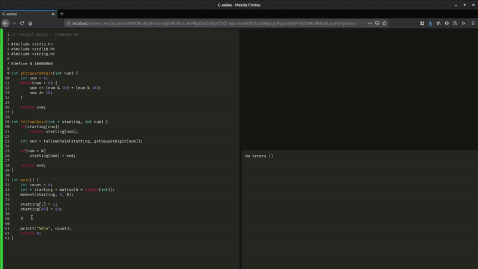

# C-online
This project started out as a web front-end for compiling and running c programs in your browser. It uses a websockets connection to connect to a server running gcc to provide a compile-as-you-type experience. Demo:

The top-right corner is empty, but is meant to take user input that can be piped to the final program.

The project only does syntax-highlighting for now, as can be noted from the above demo. A number of problems were run into, which has led me to archive this project for the moment. For one, the above screencast was recorded with the websocket server running on the machine itself. In the case of an external server, response times were way slower. Another problem was the idea of running arbitrary code on the server. Said code would need to be isolated in a container or better, a (micro-)vm.

An idea is to run the code on the browser itself. We could achieve near instantaneous compile and run times, and this can be made possible using Web Assembly.